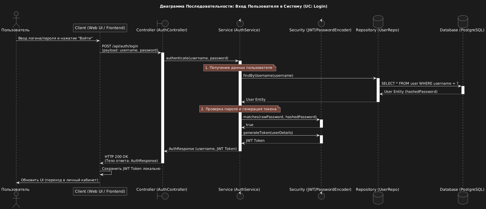
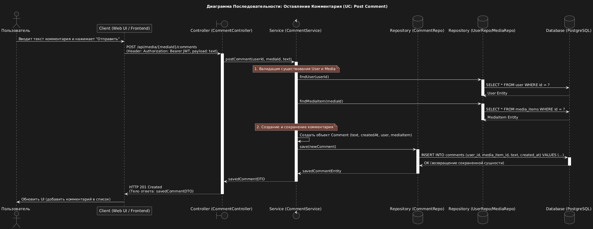

# Media Manager — Sequence Diagrams

## Overview

These diagrams visualize the interaction between the User, the Client Interface (Frontend), and the main backend components (Controller, Service, Repository, Database) for key use case scenarios of the "Media Manager" application.

## UC1: Adding Media to Collection

This scenario shows the complete process of creating a new **`UserMediaStatus`** record, including checking for duplicates and saving the initial status ("Planned") in the database.

## UC2: User Login (Authentication)

This scenario describes the user authentication process, including password verification and the subsequent issuance of a **JWT-токена** to secure future API requests.

## UC3: Leaving a Comment on Media

This scenario illustrates the process of adding a new comment. This requires the user to be authenticated (using a JWT token) and for the system to successfully link the comment to the existing **`User`** and **`MediaItem`** entities.

