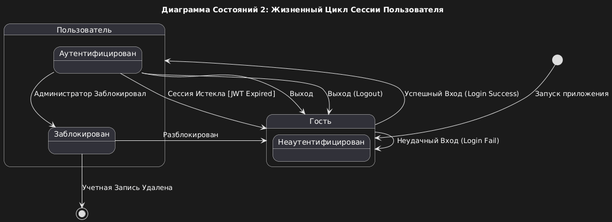

# Media Manager — State Diagrams

## Overview

These diagrams model the **life cycles** of key objects or states in the "Media Manager" system, demonstrating how they change in response to external events (triggers).

## SD1: Life Cycle of a Media Item Status (`UserMediaStatus`)

This diagram shows all possible states for tracking a media item in the user's **Personal Collection** and the transitions between them.

## SD2: Life Cycle of a User Session (Authentication)

This diagram models the user's states within the context of their authentication in the system, which affects their ability to perform protected actions (e.g., calling APIs that require a JWT token).

